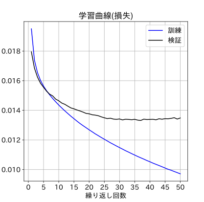
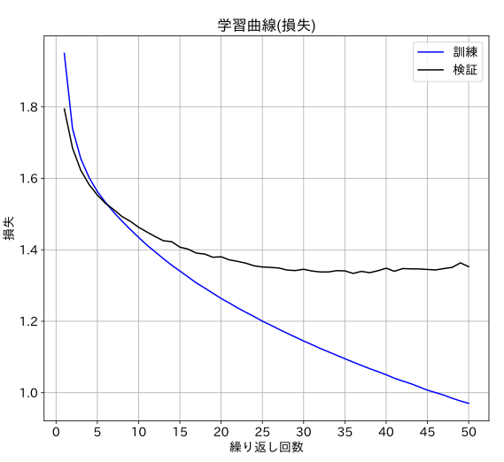
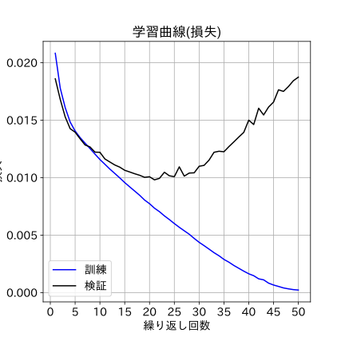
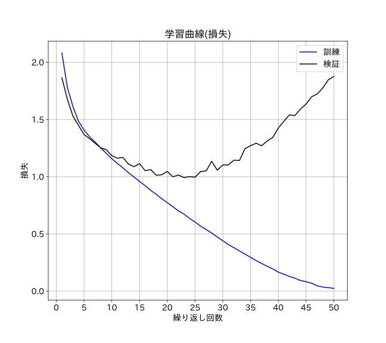

### 正誤訂正

#### 第1版第1刷
|章  |ページ  |内容　　　　　　　|補足|最終更新日|
|---|---|---|---|---|
|2章|p.81 最終行|以下の記載を追記 (sum 関数を使うと、ちょうど z と y の勾配が一致します)。|わかりにくい箇所なので記載を補いました。|2022-05-04|
|2章|p.82 コード2-22 1行目|(出版時) # 勾配計算のためには、最終値はスカラーの必要があるため、ダミーでsum関数をかける  (修正後) # 勾配計算のため、sum 関数で 1階テンソルの関数値をスカラー化する # (sum 関数を各要素で偏微分した結果は1なので、元の関数の微分結果を取得可能 )  # ( 詳細はサポートサイトの解説を参照のこと )|コメント文の説明がわかりにくかったので記載を補いました。|2022-05-04|
|4章|p.134 図4-3のweightのサイズ|(誤)左から順に[784,128] [128,10] (正)左から順に[128,784] [10,128]|本書で重み行列weightのサイズはshapeの結果で表記しています。このルールに基づくと現在の図と行・列の順番が逆になります。|2022-02-25|
|4章|p.136 図4-5のweightのサイズ|(誤)左から順に[784,128] [128,10] (正)左から順に[128,784] [10,128]|本書で重み行列weightのサイズはshapeの結果で表記しています。このルールに基づくと現在の図と行・列の順番が逆になります。|2022-02-25|
|4章|p.145 図4-7及び図4-8のweightのサイズ|(誤)左から順に[1,10] [10,10] [10,1] (正)左から順に[10,1] [10,10][1,10]|本書で重み行列weightのサイズはshapeの結果で表記しています。このルールに基づくと現在の図と行・列の順番が逆になります。|2022-02-25|
|5章|p.169 下から5行目|(誤)labels (正)labels1(labels1はlabelsのデータ形式を変換したもの。p.180～181を参照)||2022-04-03|
|5章|p.171 コード5-16 3行目から|(出版時) # ライブラリのインポート from sklearn.datasets import load_boston  # データ読み込み boston = load_boston()  # 入力データと正解データ取得 x_org, yt = boston.data, boston.target  # 項目名リスト取得 feature_names = boston.feature_names  (現在) # 「ボストン・データセット」はscikit-learnのライブラリでも取得できるが、 # その場合、将来版で利用できなくなる予定のため、別Webサイトから取得する data_url = "http://lib.stat.cmu.edu/datasets/boston" raw_df = pd.read_csv(data_url, sep="\s+",      skiprows=22, header=None) x_org = np.hstack([raw_df.values[::2, :],      raw_df.values[1::2, :2]]) yt = raw_df.values[1::2, 2] feature_names = np.array(['CRIM', 'ZN', 'INDUS', 'CHAS', 'NOX',     'RM', 'AGE', 'DIS', 'RAD', 'TAX', 'PTRATIO','B', 'LSTAT']) |出版時に利用していたscikit-learnのライブラリが将来利用できなくなるので、代替手段に実装を変えました。|2022-05-15|
|5章|p.193 コード5-44 3行目|(誤)``from torchsummary import summary``  (正)``from torchinfo import summary``||2021-10-18|
|8章|p.280 図8-3のweightのサイズ|(誤)左から順に[784,128] [128,10] (正)左から順に[128,784] [10,128]|本書で重み行列weightのサイズはshapeの結果で表記しています。このルールに基づくと現在の図と行・列の順番が逆になります。|2022-02-25|
|8章|p.314 コード8-33  最終行|（出版時）val_acc +=  (predicted_test == labels_test).sum() （現在）val_acc +=  (predicted_test == labels_test).sum().item()|PyTorchのバージョン変更に伴い、出版時のコードがエラーになった問題への対応です。|2022-04-26|
|9章|p.340  最終行|（誤）すでで説明しました。 （正）すでに説明しました。||2022-04-03|
|9章|p.347 1行目|（出版時） ３階テンソルが１階テンソルに （修正後） ４階テンソルが２階テンソルに（１件分のデータに対しては３階テンソルから１階テンソルに）|誤解しやすい表現だったので、わかりやすく書き直しました。|2022-04-03|
|9章|p.349 3行目|(誤)損失精度 (正)検証精度||2022-02-25|
|9章|p.367 コード9-27の実行結果|(出版時) Total params: 1,628,756 Trainable params: 1,628,756 Total mult-adds(M): 18.43 Params size(MB): 6.52 Estimated Total Size(MB): 50.96  (現在) Total params: 814,378 Trainable params: 814,378 Total mult-adds(M): 886.11 Params size(MB): 3.26 Estimated Total Size(MB): 47.71|出版時のtorchinfoは、コンテナ(入れ物)型レイヤー関数であるSequentialオブジェクト内のパラメータ数もTotal params/Trainable paramsの計算時に加算するロジックであったため、結果的にパラメータ数がダブルカウントになっていました。現在はダブルカウントがなくなったため、パラメータ数が紙面の半分になっていますが、現在の数値が正しいです。他の３項目に関しては、パラメータ数から算出される値のため、上記事象に付随して変わりました。|2022-04-03|
|10章|p.393 コード10-7 下から６行目|(誤)``self.l2 = nn.Linear(128, 10)`` (正)``self.l2 = nn.Linear(128, num_classes)``||2022-04-03|
|11章|p.439 コード11-8 3行目|(誤)``summary(net,(3,112,112))`` (正)``summary(net,(100,3,112,112))``||2022-02-25|
|講座1 L1.7|p.520 5行目|(誤) yという名前のライブラリのうちxという関数だけを利用  (正) xという名前のライブラリのうちyという関数(または変数・クラス)だけを利用||2021-10-18|
|講座3 L3.3|p.558 コードL3-9 6行目|(出版時) ``mnist = fetch_openml('mnist_784', version=1,)``  (修正後) ``mnist = fetch_openml('mnist_784', version=1,as_frame=False)``|誤りではないのですが、最新版Anacondaに含まれるscikit-learn 0.24.0を使うとエラーになる事象が見つかり、将来に備えてコード側を修正しました。|2021-11-02|

#### 第1版1～2刷
|章  |ページ  |内容　　　　　　　|補足|最終更新日|
|---|---|---|---|---|
|序章|p.14 コード4 5行目、7行目、9行目|(修正前) loss: 0.12345 acc: 0.65000 val_loss: 0.07783 loss: 0.07584 acc: 0.85000 val_loss: 0.04895 loss: 0.03976 acc: 0.92500 val_loss: 0.05762 (修正後) loss: 0.61725 acc: 0.65000 val_loss: 0.38917 loss: 0.37922 acc: 0.85000 val_loss: 0.24473 loss: 0.19879 acc: 0.92500 val_loss: 0.28811|共通関数(fit)の修正に伴い結果が変わりました|2023-03-24|
|序章|p.15 コード5|コード全体を読みやすく修正|具体的な修正内容は次のリンクを参照 [修正箇所diff](./code-diff-ch0.md)|2023-03-24|
|2章|p.81 コード2-21 1行目|(誤)グラフ(散布図)描画 (正)グラフ描画||2023-03-24|
|2章|p.89 コード2-22 1行目|(誤)グラフ(散布図)描画 (正)グラフ描画||2023-03-24|
|3章|p.129 コード3-27 6行目|(誤)plt.show()l (正)plt.show()||2023-03-24|
|8章|p.303 コード8-22 6行目|(修正前)``n_output = len(set(list(labels.data.numpy())))`` (修正後)``n_output = 10``|修正前の実装だと、期待していない値である9に設定される可能性があるのでより確実な実装に修正しました。|2023-01-27|
|8章|p.312 コード8-31|紙面とGithubの実装コードが一致していません。正しくは3行目に次の2行が追加されます。 torch.backends.cudnn.deterministic = True torch.use_deterministic_algorithms = True ||2023-03-24|
|8章|p.312 コード8-32|コード全体を読みやすく修正|具体的な修正内容は次のリンクを参照 [修正箇所diff](./code-diff-ch8.md) |2023-03-24|
|8章|p.313 コード8-33|コード全体を読みやすく修正|具体的な修正内容は次のリンクを参照 [修正箇所diff](./code-diff-ch8.md) |2023-03-24|
|8章|p.314 コード8-33 3行目|紙面とGithubの実装コードが一致していません。 (誤)予測データ (正)予測ラベル||2023-03-24|
|9章|p.349 コード9-10|コード全体を読みやすく修正|具体的な修正内容は次のリンクを参照 [修正箇所diff](./code-diff-ch9.md) |2023-03-24|
|9章|p.350 コード9-11|コード全体を読みやすく修正 紙面に記載のない部分で修正後に損失にバッチサイズをかけている箇所があり、結果的に損失値は旧バージョンの100倍になっています|具体的な修正内容は次のリンクを参照 [修正箇所diff](./code-diff-ch9.md) |2023-03-24|
|9章|p.350 コード9-12|コード全体を読みやすく修正 紙面に記載のない部分で修正後に損失にバッチサイズをかけている箇所があり、結果的に損失値は旧バージョンの100倍になっています|具体的な修正内容は次のリンクを参照 [修正箇所diff](./code-diff-ch9.md) |2023-03-24|
|9章|p.358 コード9-21 6行目|(修正前)``n_output = len(set(list(labels.data.numpy())))`` (修正後)``n_output = len(classes)``|修正前の実装だと、期待していない値である9に設定される可能性があるのでより確実な実装に修正しました。|2023-01-27|
|9章|p.360 コード9-23 下から2行目と一番下|(修正前) loss 0.01950 acc 0.32214 val_loss 0.01794 loss 0.01738 acc 0.32214 val_loss 0.01684 (修正後) loss 1.94965 acc 0.32214 val_loss 1.79429 loss 1.73841 acc 0.32214 val_loss 1.68432|共通関数(fit)の修正に伴い結果が変わりました|2023-03-24|
|9章|p.361 コード9-24 下から2行目と一番下|(修正前) 損失:0.01794 損失:0.01353 (修正後) 損失:1.79429 損失:1.35274|共通関数(fit)の修正に伴い結果が変わりました|2023-03-24|
|9章|p.362 図9-12|(修正前) (修正後) |共通関数(fit)の修正に伴い結果が変わりました|2023-03-24|
|9章|p.370 コード9-28 下から2行目と一番下|(修正前) loss 0.01950 acc 0.32214 val_loss 0.01794 loss 0.01738 acc 0.32214 val_loss 0.01684 (修正後) loss 1.94965 acc 0.32214 val_loss 1.79429 loss 1.73841 acc 0.32214 val_loss 1.68432 |共通関数(fit)の修正に伴い結果が変わりました|2023-03-24|
|9章|p.370 コード9-29 下から2行目と一番下|(修正前) 損失:0.01794 損失:0.01353 (修正後) 損失:1.79429 損失:1.35274|共通関数(fit)の修正に伴い結果が変わりました|2023-03-24|
|9章|p.371 図9-15|(修正前) (修正後) |共通関数(fit)の修正に伴い結果が変わりました|2023-03-24|
|10章|p.416 コード9-11(再掲) コード9-12(再掲)|コード全体を読みやすく修正 紙面に記載のない部分で修正後に損失にバッチサイズをかけている箇所があり、結果的に損失値は旧バージョンの100倍になっています|具体的な修正内容は次のリンクを参照 [修正箇所diff](./code-diff-ch9.md) |2023-04-01|
|10～12章|損失計算に関わる箇所全般| 9章から12章では、損失値は共通関数(fit関数)で計算しています。バッチ学習法において、損失値の累積計算では、損失関数の出力値にバッチサイズをかけた値を対象にすべきです。しかし、本書発売時点の共通関数の実装ではこの点への考慮が漏れており、結果的に損失値の計算結果が不正確になっていました。 　このため、GitHub上の共通関数を正しく実装し直しました。その結果、Google Colab上で計算される損失値や損失の学習曲線は、紙面とは異なる結果になり、9章については、その違いを上記のように細かく示しました。 　一方、10章以降については、正誤表による個別の記載を割愛させて頂きます。紙面とGoogle Colab上の実行結果は異なりますが、後者の方が正しいので、そのように読み替えてください。 　また、以上の違いはすべて共通関数による損失値の計算結果にだけ起きるものです。モデルは意図した正しいものが本書発売時点から生成されており、精度などにも間違いはありません。 | 具体的な修正内容(共通関数内部)は次のリンクを参照 [修正箇所diff](./code-diff-libs.md) | 2023-03-24 |

[メインページに戻る](../README.md)
